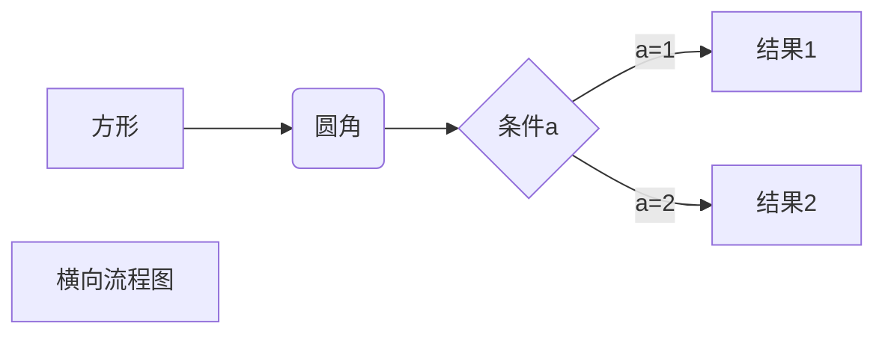
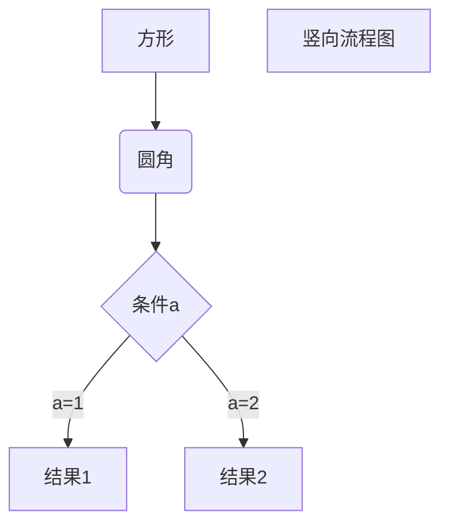
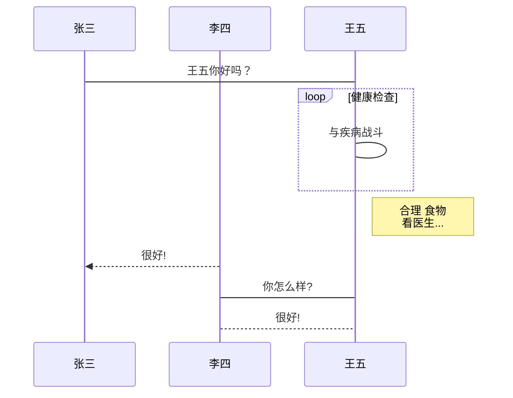
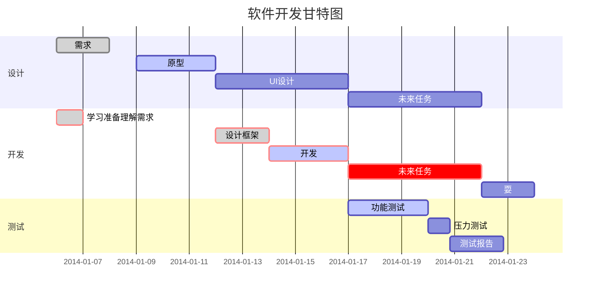

+ **Markdown 编写的文档后缀为 .md或 .markdown**


 # 一级标题

## 二级标题

### 三级标题

#### 四级标题

##### 五级标题

###### 六级标题

正文   

<p>换行</p>


一级标题
====

二级标题
--


*1* 

_1_

**1**

__1__

***1***

___1___

~~1~~

<u>下划线</u>


脚注 [^把鼠标移到这]


`框框`


\-\+\_\*\#\~\`\!\|\\\{}\[]\<\>\&


+ \+

- \-

* \*
  * \*
    * \*
      * \*


1. 1\.
2. 2\.
   1. Enter→Backspace


>这是引用的内容
>>这是引用的内容
>>
>>>这是引用的内容


---

+++

***

___


```markdown
​```
```

~~~
​~~~
~~~

	?


:smile:


<kbd>Ctrl</kbd>


[链接](https://www.baiu.com/"titie")

title可加可不加

<https://www.baidu.com/>

如果想要在新页面中打开的话可以用html语言的a标签代替

<a href="超链接地址" target="_blank">超链接名</a>

>target属性（指定链接的打开方式，可不写）：
>_blank: 跳转新页面
>_self：默认，当前页面跳转
>href：跳转的路径

<details><summary>其他:</summary>
<a href="">跳转</a>  //空链接，当前页面跳转，刷新页面</p>
<a href="#">跳转</a> //空锚点，回到最顶端，不刷新页面</p>
mailto：会自动检测本机系统是否安装邮箱，如果有就会自动打开邮箱,</p>
没有则会提示用户选择邮箱或者没提示</p>
<a href="mailto:1533233@qq.com">发送邮件</a></p>
<a href="tel:12345678910">一键拨打电话</a></p>
<a href="sms:12345678910">一键发送短信</a></p>
</details>


> 图片alt就是显示在图片下面的文字，相当于对图片内容的解释。
> 图片title是图片的标题，当鼠标移到图片上时显示的内容。title可加可不加


| 表头 | 表头 | 表头 |
| :--- | :--: | ---: |
| 内容 | 内容 | 内容 |
| 内容 | 内容 | 内容 |








```flow
st=>start: 开始框
op=>operation: 处理框
cond=>condition: 判断框(是或否?)
sub1=>subroutine: 子流程
io=>inputoutput: 输入输出框
e=>end: 结束框
st->op->cond
cond(yes)->io->e
cond(no)->sub1(right)->op
```


```flow
st=>start: 开始框
op=>operation: 处理框
cond=>condition: 判断框(是或否?)
sub1=>subroutine: 子流程
io=>inputoutput: 输入输出框
e=>end: 结束框
st(right)->op(right)->cond
cond(yes)->io(bottom)->e
cond(no)->sub1(right)->op
```


```sequence
对象A->对象B: 对象B你好吗?（请求）
Note right of 对象B: 对象B的描述
Note left of 对象A: 对象A的描述(提示)
对象B-->对象A: 我很好(响应)
对象A->对象B: 你真的好吗？
```


```sequence
Title: 标题：复杂使用
对象A->对象B: 对象B你好吗?（请求）
Note right of 对象B: 对象B的描述
Note left of 对象A: 对象A的描述(提示)
对象B-->对象A: 我很好(响应)
对象B->小三: 你好吗
小三-->>对象A: 对象B找我了
对象A->对象B: 你真的好吗？
Note over 小三,对象B: 我们是朋友
participant C
Note right of C: 没人陪我玩
```








[^把鼠标移到这]:会出现一行字